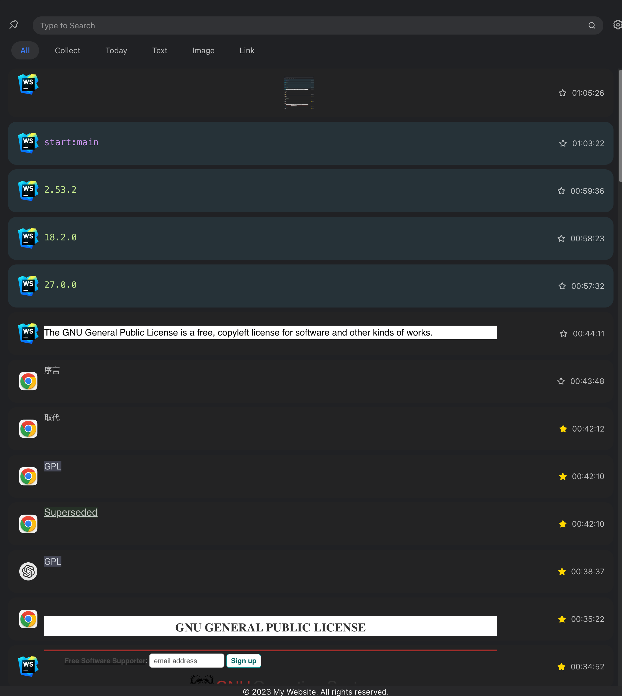

# Electron-ClipBoard-Manager(ECM)

## 简介
  这是一个由Electron + React + ArcoDesign 实现的剪切板管理工具。目前仅支持MacOS，但在不久的将来，将会陆续支持Windows和Linux。现在还在开发
  初期，各种缺陷会有很多，但是作者会持续修复，发现缺陷请在issue中添加，作者将使用空余时间修复。
  PS： UI借鉴了 PasteNow

## 开发
  目前项目结构还未完全优化完成，所以开发环境还不是特别理想，项目结构的调整将在MacOS端功能完善后进行调整

  > Node: 18.18.0  Electron: 27.0.0  React: 18.2.0  ArcoDesign: 2.53.2

### 初始化
  ```shell
    yarn init:all // 安装主进程和渲染进程的依赖
  ```
### 运行
  ``` shell
    yarn start:mac  // 在macOS中启动主进程&渲染进程
    yarn start:win  // 在windows中启动主进程&渲染进程
  ```
  ```shell
    yarn start:main //启动主进程
    yarn start:renderer //启动渲染进程
  ```
### 打包
  ``` shell
    yarn dist
  ```

## 应用截图



## 下一个版本功能
- 完善菜单/设置界面功能开发
- 重复逻辑判断优化
- 删除/收藏功能优化（新增内容未无id导致）
- 图片复制bug修复

## 更新日志
#### v0.0.2 (2023-10-30)
- windows支持图标获取，linux基础复制黏贴功能完成
- 右键菜单采用electron系统菜单
- 增加代码检测
- 修改重复检测逻辑为10条队列
- 置顶失败bug修复

#### v0.0.1 (2023-10-27)
这是第一个版本，非常粗糙，但是剪切板该有的基础功能已经有了（MacOS）
我将争取在11月前，完成对Linux和Windows的基础功能进行支持
目前已经实现功能
- 剪切板监听，并存入数据库
- i18n支持
- 复制来源icon获取
- 双击实现剪切板内容复制
- 文本搜索功能
- 内容分类
- 呼出快捷键实现
- 部分菜单功能
- 收藏功能
