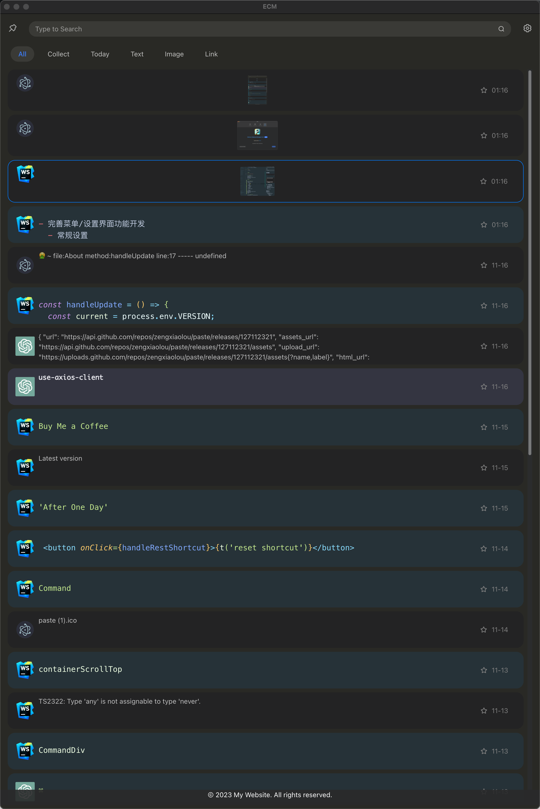
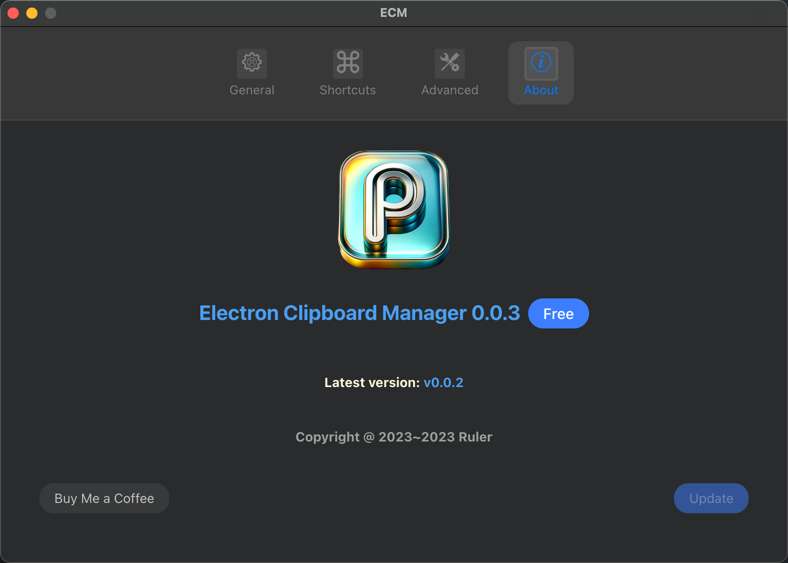
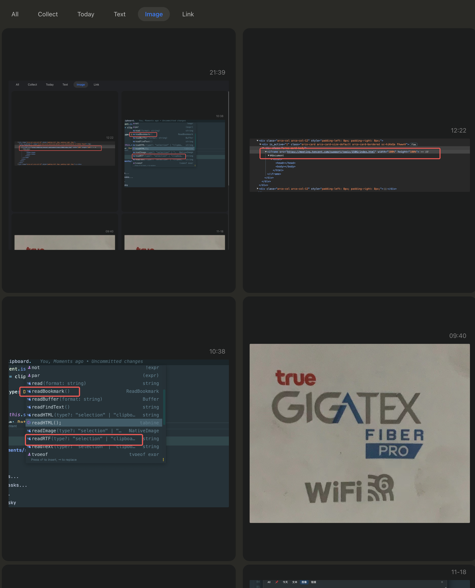

# Electron-ClipBoard-Manager (ECM)

## Introduction
  This is a clipboard management tool implemented with Electron + React + ArcoDesign.Currently, all features have been implemented on macOS, while Windows and Linux have the core features, but the pages need further optimization. Next, the focus will be on optimizing Windows and Linux. I hope the experts can provide some suggestions to make this tool more perfect.
  PS: The UI is inspired by PasteNow.

## Development
  The project did not use any Electron-related scaffolding, so the overall quality is not very good. However, the development is now complete, and the next step will be to devote time to optimizing the entire architecture.

  > Node: 18.18.0  Electron: 27.0.0  React: 18.2.0  ArcoDesign: 2.53.2

### Initialization
  ```shell
    yarn init:all // Run in the project root directory
  ```
### Running
  ``` shell
    yarn start:mac  // Start main process & rendering process on macOS
    yarn start:win  // Start main process & rendering process on windows
  ```
  ```shell
    yarn start:main // Start main process
    yarn start:renderer // Start rendering process
  ```
### Build
  ``` shell
    yarn dist
  ```

## Application Screenshots






## Features for the Next Version

- Quick Select Function
- Optimize Windows and Linux Page Display
- Fix Right-Click Unactivated Function Error
- Paste Content as Rich Text/Plain Text Based on Requirement
- Main Process Uses resolvePath to Replace Complex Relative Paths
- Change Preload to TypeScript (TS)

## Changelog

#### v1.0.0(2023-11-19)
- Quantity Statistics Display
- Add Link Opening Feature
- Add Image Detail View
- Add Husky
- Disable Menu on Linux and Windows
- Disable Frame

#### v0.0.3 (2023-11-17)
- Enhance the functionality of the menu/settings interface
  - General Settings
    - Start with the system
    - Copy sound effect
    - Language selection
  - Shortcut Key Settings
    - Quick wake/hide
    - Tab switching
    - Reset shortcuts
  - Advanced Settings
    - Scheduled deletion of old data
  - About
    Update settings
- Optimize logic for duplicate judgments
- Improve delete/favorite features (new content has no ID issue)
- Fix the bug with copying images
- Replace the icon

#### v0.0.2 (2023-10-30)
- Support for icon retrieval on Windows, basic copy-paste functionality completed on Linux
- Context menu utilizes Electron system menu
- Code detection added
- Modified repetitive detection logic to a 10-item queue
- Bug fix for pin-to-top failure

#### v0.0.1 (2023-10-27)
"This is the first version, which is very rough, but the basic functionalities that a clipboard should have are already in place (MacOS).
I will strive to support the basic functionalities for Linux and Windows by November.
The currently implemented features are:

- Clipboard monitoring and saving to the database
- i18n (internationalization) support
- Retrieving icons of the source of copied content
- Double-clicking to copy clipboard content
- Text search function
- Content categorization
- Shortcut key activation
- Some menu functions
- Favorites feature."

